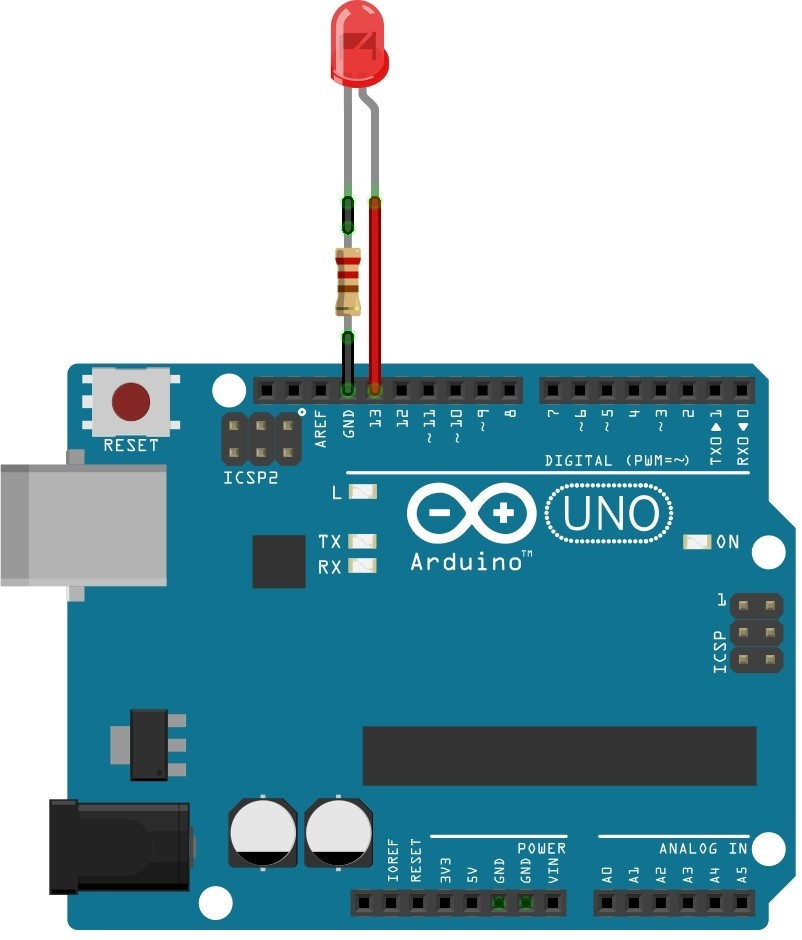
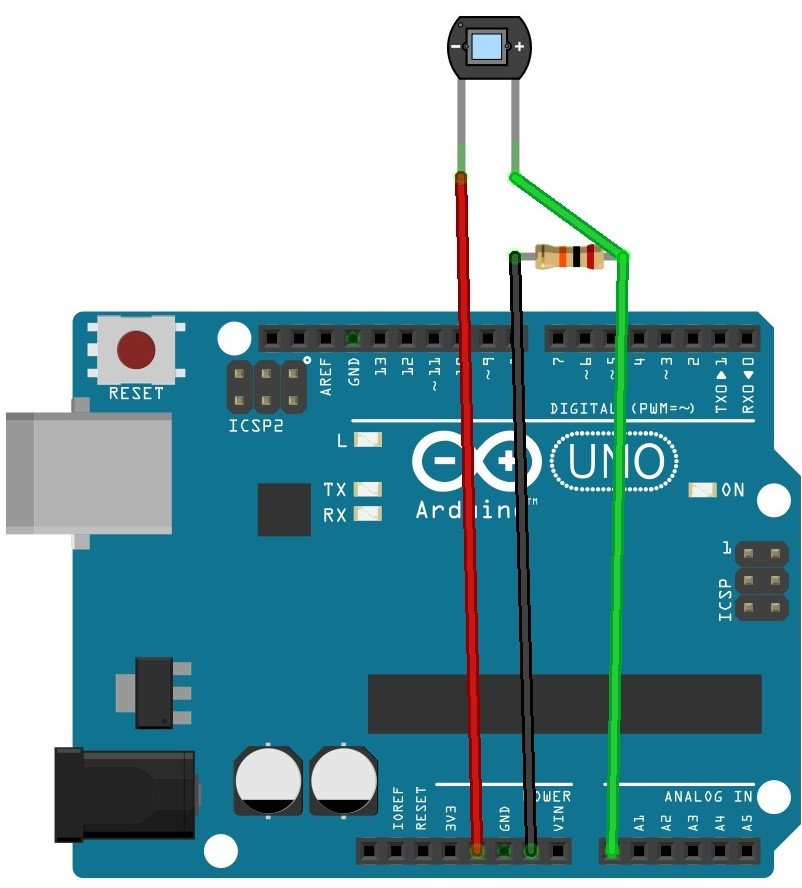

# VLC-Arduino

Transmisión Inalámbrica entre dos Arduinos mediante luz visible o mejor conocido como VLC (Visible Light Communication).

## Emisor

Se tiene un Arduino, una resistencia y un LED para el emisor.

El código emisor en Arduino solo enciende o apaga el LED en el pin digital 13.

### Configuraciones Probadas para Emisor VLC

- Arduino: Mega
- LED: Rojo
- Resistencia: 220 ohms

## Receptor

Se tiene un Arduino, una resistencia y un fotodiodo para el receptor.

El código receptor en Arduino lee el pin analógico 0, implementa el Control de Ganancia Automática (AGC) y normaliza la entrada para tener 1 o 0.

El AGC actualiza los valores máximos y mínimos leídos y con ello los promedia para obtener el umbral que determina si es un 1 o un 0.

### Configuraciones Probadas para Receptor VLC

- Arduino: Mega
- Fotodiodo
- Resistencia: 20 000 ohms

